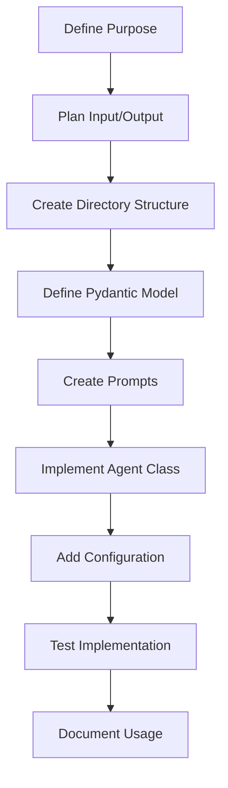
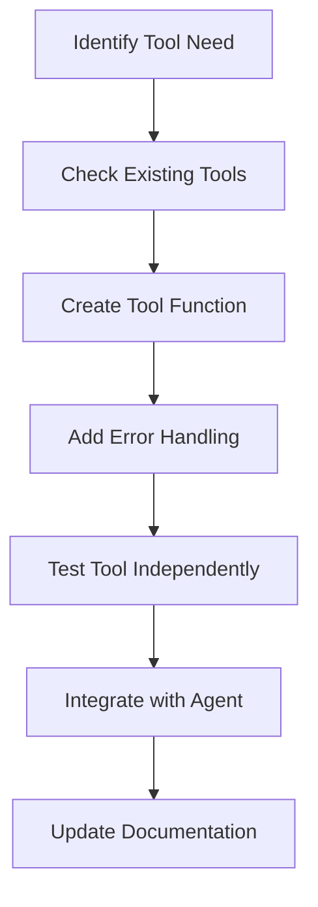
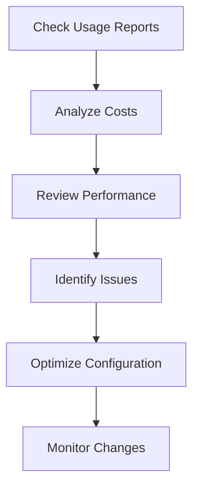

# AI Helper Documentation

## Overview

This documentation provides comprehensive guidance for working with the AI Helper system - an LLM integration layer built on PydanticAI that enables structured interactions with multiple language model providers.

## Quick Start

For LLMs building new components:

1. **Creating Agents**: Read [Agent Development Guide](agents/README.md) and [How to Create Agents](agents/how-to-create-agents.md)
2. **Defining Models**: See [Models Documentation](models/README.md)
3. **Adding Tools**: Check [Tools Documentation](tools/README.md)
4. **Understanding Reports**: Review [Reporting Documentation](reporting/README.md)

## Documentation Structure

### 📚 Core Components

#### [Agents](agents/README.md)
Specialized components that execute specific tasks using LLM capabilities. Each agent handles model selection, prompt management, and structured output generation.

**Key Topics:**
- Agent architecture and base classes
- Configuration management via YAML
- Model selection and fallback strategies
- Integration with tools and workflows

**Read This When:**
- Building new specialized LLM-powered functionality
- Need to understand existing agent capabilities
- Want to configure model selection and fallbacks

#### [Models](models/README.md)
Pydantic models that define structured output formats for LLM interactions, providing type safety and validation.

**Key Topics:**
- BasePyModel architecture and features
- Field validation and error handling
- Test framework integration
- Performance optimization techniques

**Read This When:**
- Defining new structured output formats
- Need reliable data extraction from LLMs
- Want to understand existing model schemas

#### [Tools](tools/README.md)
Standalone functions that extend LLM capabilities by providing access to external APIs, calculations, and data sources.

**Key Topics:**
- Tool definition patterns and conventions
- Integration with agents and LLM calls
- Error handling and security considerations
- Performance and caching strategies

**Read This When:**
- Adding new capabilities to LLM interactions
- Need to connect LLMs to external services
- Want to understand existing tool functionality

#### [Reporting](reporting/README.md)
Comprehensive usage tracking and cost analysis system for monitoring LLM performance and optimizing resource usage.

**Key Topics:**
- Usage tracking and cost calculation
- Performance metrics and quality assessment
- Report generation and formatting
- Data aggregation and analysis

**Read This When:**
- Monitoring system performance and costs
- Optimizing model selection strategies
- Need to understand usage patterns

### 🎯 Getting Started Guides

#### [How to Create Agents](agents/how-to-create-agents.md)
**Purpose**: Step-by-step guide for building new agents from scratch

**Covers:**
- Planning and designing agents
- Directory structure and file organization
- Implementation patterns and best practices
- Configuration, testing, and integration

**Use This To:**
- Build your first agent
- Understand agent development workflow
- Follow established conventions and patterns

## Architecture Overview

```
┌─────────────────────────────────────────────────────────────┐
│                        AI Helper                            │
├─────────────────────────────────────────────────────────────┤
│  ┌─────────────┐  ┌─────────────┐  ┌─────────────┐         │
│  │   Agents    │  │   Models    │  │    Tools    │         │
│  │             │  │             │  │             │         │
│  │ • TextEdit  │  │ • HelloWorld│  │ • Calculator│         │
│  │ • FileProc  │  │ • Weather   │  │ • Weather   │         │
│  │ • Feedback  │  │ • FileAnalys│  │ • Date      │         │
│  └─────────────┘  └─────────────┘  └─────────────┘         │
├─────────────────────────────────────────────────────────────┤
│                    Usage Tracking                          │
│  ┌─────────────────────────────────────────────────────────┐│
│  │ • Cost Analysis  • Performance Metrics  • Reports     ││
│  └─────────────────────────────────────────────────────────┘│
├─────────────────────────────────────────────────────────────┤
│                     LLM Providers                          │
│  ┌──────────┐ ┌──────────┐ ┌──────────┐ ┌──────────┐      │
│  │ OpenAI   │ │Anthropic │ │ Google   │ │OpenRouter│      │
│  └──────────┘ └──────────┘ └──────────┘ └──────────┘      │
└─────────────────────────────────────────────────────────────┘
```

## Common Workflows

### 1. Building a New Agent



**Files to Read:**
1. [How to Create Agents](agents/how-to-create-agents.md) - Complete walkthrough
2. [Models Documentation](models/README.md) - For output model design
3. [Agent Configuration](agents/README.md#configuration-system) - For YAML setup

### 2. Adding Tool Integration



**Files to Read:**
1. [Tools Documentation](tools/README.md) - Tool development guide
2. [Agent Integration](agents/README.md#integration-points) - Using tools in agents

### 3. Monitoring and Optimization



**Files to Read:**
1. [Reporting Documentation](reporting/README.md) - Understanding metrics
2. [Agent Configuration](agents/README.md#configuration-system) - Optimization options

## Development Best Practices

### For LLM-Generated Code

When an LLM creates new components, follow these principles:

1. **Read Relevant Docs First**: Always start by reading the appropriate documentation section
2. **Follow Patterns**: Use existing implementations as templates
3. **Validate Integration**: Test with the actual system, not just in isolation
4. **Document Changes**: Update documentation for any new patterns or capabilities

### Code Organization

```
src/
├── agents/
│   ├── implementations/your_agent/    # New agent implementation
│   └── config/agents.yaml            # Agent configuration
├── py_models/your_domain/            # New model definitions
├── tools/tool_your_feature.py        # New tool implementations
└── helpers/                          # Shared utilities
```

### Configuration Management

All behavioral configuration should be externalized:

```yaml
# agents.yaml
your_agent:
  default_model: "gpt-4o"
  fallback_model: "claude-3-5-sonnet"
  capabilities: ["feature1", "feature2"]
  system_prompt: |
    Specialized instructions for your agent
```

### Testing Strategy

1. **Unit Tests**: Test individual components in isolation
2. **Integration Tests**: Test with real LLM calls
3. **Performance Tests**: Monitor token usage and costs
4. **Validation Tests**: Ensure output quality meets requirements

## Common Patterns

### Error-Resilient Agents

```python
class RobustAgent(AgentBase):
    async def safe_operation(self, input_data: str, **kwargs):
        try:
            return await self.run(
                prompt=self.format_prompt(input_data),
                pydantic_model=MyModel,
                **kwargs
            )
        except Exception as e:
            # Fallback strategy
            return await self.run(
                prompt=self.simplified_prompt(input_data),
                pydantic_model=SimpleModel,
                model_name=self.config.get('fallback_model'),
                **kwargs
            )
```

### Progressive Enhancement

```python
class EnhancedAgent(AgentBase):
    async def process_with_validation(self, content: str, **kwargs):
        # Initial processing
        result = await self.basic_processing(content, **kwargs)
        
        # Quality check
        if result.confidence_score < 0.8:
            # Enhanced processing for low-confidence results
            result = await self.enhanced_processing(content, **kwargs)
            
        return result
```

### Multi-Step Workflows

```python
class WorkflowAgent(AgentBase):
    async def complex_workflow(self, input_data: str, **kwargs):
        # Step 1: Initial analysis
        analysis = await self.analyze(input_data, **kwargs)
        
        # Step 2: Processing based on analysis
        processed = await self.process(
            input_data, 
            context=analysis.findings,
            **kwargs
        )
        
        # Step 3: Quality validation
        validated = await self.validate(processed, **kwargs)
        
        return validated
```

## Troubleshooting

### Common Issues

1. **Import Errors**: Check file paths and module structure
2. **Configuration Problems**: Verify YAML syntax and required fields
3. **Model Validation Failures**: Review field constraints and data types
4. **Performance Issues**: Check usage reports for optimization opportunities

### Debug Resources

- **Usage Reports**: `python cli.py --usage` for performance insights
- **Model Testing**: Use test cases in `py_models/*/tests/` directories
- **Configuration Validation**: Check agent registry auto-discovery
- **Tool Testing**: Test tools independently before integration

### Getting Help

1. **Check Documentation**: Start with relevant section above
2. **Review Examples**: Look at existing implementations
3. **Test Incrementally**: Build and test components step by step
4. **Monitor Usage**: Use reporting system to track performance

## File Locations Quick Reference

| Component | Configuration | Implementation | Documentation |
|-----------|---------------|----------------|---------------|
| Agents | `src/agents/config/agents.yaml` | `src/agents/implementations/` | [agents/](agents/) |
| Models | Model files | `src/py_models/` | [models/](models/) |
| Tools | Environment variables | `src/tools/` | [tools/](tools/) |
| Reports | `logs/usage.json` | `src/helpers/usage_tracker.py` | [reporting/](reporting/) |

---

This documentation is designed to enable LLMs to understand and extend the AI Helper system effectively. Each section provides both conceptual understanding and practical implementation guidance.